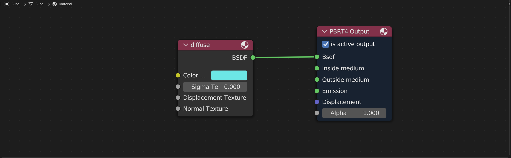
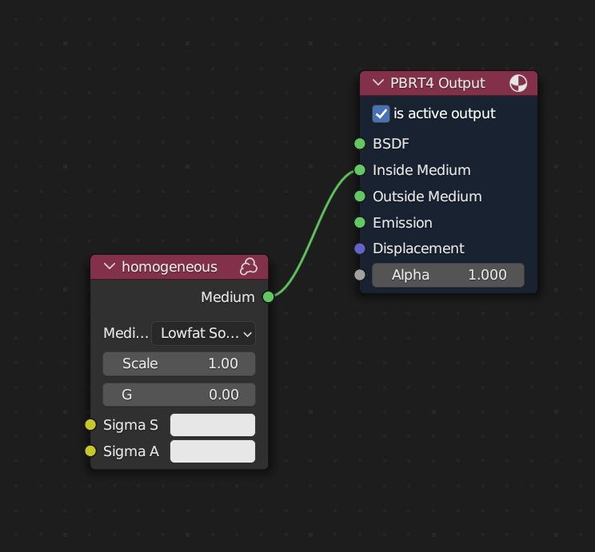

# bpbrt4 for Windows (Early Release)
## pbrt-v4 render engine/exporter add-on for Blender
Based on [original repository by NicNel](https://github.com/NicNel/bpbrt4).

This in turn was based on mesh_ply.py from Blender Mitsuba Add-On.

This version is updated for current master branch of pbrt-v4, tested using blender 3.6.

### How to use

#### Installation

Blender add-ons are installed as `zip` archives. I would recommend either using the "Download as ZIP" option on Github, or cloning the repository and then compressing the result to a zip archive.

From Blender, navigate to "Edit" -> "Preferences" -> "Add-ons" tab, "Install..." button. Select the zip archive. 

The add-on should appear as "Render: PBRTV4_Exporter" below. Make sure to tick the box to enable the add-on.

#### Rendering

- Set your Render Engine to PBRTV4 Renderer
- Set the path to the folder containing your PBRT V4 binary (i.e. `pbrt.exe`) under PBRTV4 Bin.
- Set the "Project Folder" property to the directory you'd like to contain your generated `.pbrt` files and rendered `.exr` images.
- Render as usual, using e.g. F12, or by clicking the "Start Render" button.
- Optionally, if you want to just generate the `.pbrt` outputs and not render, select "Export scene only". You can then render at your leisure using `pbrt.exe`.

Render progress and info messages are printed the console (enable the console under Window -> Toggle System Console).

#### Setting up Materials

All materials should use PBRTV4 nodes to work correctly in the PBRTV4 renderer.

Ensure you use the `PBRTV4 Output` node, and not a standard Blender shader (like "Principled BSDF" for example).

Inputs such as images should also make use of the PBRT image texture node `PBRTV4 Textures->Image`.

For Image textures, set the mode to either spectrum (represents a colour value) or float (e.g. a displacement map) as appropriate.

Textures used as normal maps must have the is Normal property set. 

Example minimal setup using the diffuse shader:

##### Special Case: Participating Media

If you want to set up a participating medium inside a mesh without adding a BSDF to its surface, simply bind to only the Inside Medium (and possibly Outside Medium) node(s).

This is equivalent to setting Material "interface" in PBRT.

#### Limitations

Currently materials do not appear correctly in the `Rendered` and `Material Preview` view modes. As a result I recommend the use of `Solid` or `Wireframe` when composing scenes.

Currently only the `point`, `distant` and `spotlight` light types are supported in Blender. These correspond to the blender light types `Point`, `Sun` and `Spot` respectively.

